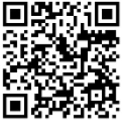

# ⚡ Eletricidade Estática — Ciência & Segurança

> Landing page educacional e interativa sobre eletricidade estática, com foco em física, aviação civil, prevenção industrial e segurança operacional.

---

## 🌍 Acesse o Site

**🔗 Link direto:** [https://leomarxs.github.io/Site-Eletrica/](https://leomarxs.github.io/Site-Eletrica/)

**📱 QR Code:**



---

## 📋 Sumário

- [Visão Geral](#visão-geral)
- [Estrutura de Conteúdo](#estrutura-de-conteúdo)
- [Seções e Páginas](#seções-e-páginas)
- [Funcionalidades Interativas](#funcionalidades-interativas)
- [Tecnologias Utilizadas](#tecnologias-utilizadas)
- [Como Abrir o Site](#como-abrir-o-site)

---

## 🌐 Visão Geral

O site **Eletricidade Estática — Ciência & Segurança** é uma landing page de página única (*single-page*) desenvolvida com HTML, CSS e JavaScript puro. Foi projetada com estética sci-fi/industrial dark, partículas animadas e interações ricas para apresentar de forma visual e dinâmica o conteúdo técnico-científico sobre eletricidade estática.

O material cobre desde a origem histórica do fenômeno até as aplicações modernas na aviação, indústria petroquímica e têxtil — incluindo normas internacionais, vídeo educacional e referências bibliográficas.

---

## 📂 Estrutura de Conteúdo

O conteúdo está organizado em **8 seções numeradas**, acessíveis pela barra de navegação fixa no topo:

```
01 — Contexto Histórico e Científico
02 — Foco Aeronáutico
03 — Riscos Gerais
04 — Medidas de Mitigação e Segurança na Aviação
05 — Processos de Prevenção
06 — Cotidiano e Indústria
07 — Vídeo de Apoio
08 — Referências Bibliográficas
```

---

## 📄 Seções e Páginas

### 🏠 Hero — Tela Inicial
A tela de entrada apresenta o título principal com gradiente animado, três raios SVG que piscam com efeito de faísca, partículas elétricas flutuando em background e um indicador de scroll animado. É o primeiro impacto visual do site.

---

### 01 — Contexto Histórico e Científico
**Subtópicos:** 1.1 · 1.2

Aborda a origem histórica da eletricidade estática, desde a antiguidade greco-romana (âmbar/*elektron*) até a Revolução Industrial e as investigações de Benjamin Franklin no século XVIII.

Inclui:
- **Contador animado** com três métricas históricas (600 anos A.C., século 18, 3 pioneiros)
- **Escala Triboelétrica interativa** — barras animadas que mostram a tendência de carga (positiva/negativa) de materiais como vidro, nylon, borracha, PTFE (Teflon)
- **Tags de exemplos** do efeito triboelétrico no cotidiano

---

### 02 — Contexto Histórico e Científico (Foco Aeronáutico)
**Subtópicos:** 2.1 · 2.2 · 2.3 · 2.4

Seção dedicada exclusivamente ao contexto aeronáutico, cobrindo a evolução do problema desde os primórdios da aviação.

Inclui:
- **Timeline histórica animada** com três marcos: Início séc. XX → 2ª Guerra Mundial → Era Moderna
- **Cards de contexto** explicando o *Precipitation Static (P-Static)* e a evolução do problema
- **4 cards de fontes triboelétricas** na aeronave: gelo, poeira/areia, fluxo de combustível e atrito aerodinâmico
- **Banner de alerta** sobre as diferenças elétricas entre fuselagens de alumínio e fibra de carbono
- **Dois cards de risco** lado a lado: Durante o Voo (ciano) × Em Solo/Reabastecimento (âmbar)
- **Grid de 6 evoluções tecnológicas**: static wicks, malhas metálicas, bonding, certificação elétrica, aditivos antiestáticos e projeto estrutural integrado

---

### 03 — Riscos Gerais
Apresenta os riscos do acúmulo de cargas elétricas em qualquer contexto (industrial e doméstico).

Inclui:
- **5 cards de risco** com animação de deslizamento horizontal ao hover
- **Caixa de destaque** sobre o risco específico no setor aeronáutico

---

### 04 — Medidas de Mitigação e Segurança na Aviação
**Subtópicos:** 4.1 · 4.2 · 4.3

Explica as três principais medidas adotadas pela aviação civil contra eletricidade estática.

Inclui:
- **4.1** — Descarregadores Estáticos (*Static Wicks*)
- **4.2** — Equipotencialização (*Bonding*)
- **4.3** — Aterramento no Reabastecimento
- Cards com efeito de luz radial que segue o cursor do mouse

---

### 05 — Processos de Prevenção
**Subtópicos:** 5.1 · 5.2

Detalha as abordagens técnicas para evitar o acúmulo de cargas elétricas.

Inclui:
- **5.1** — Materiais Compostos e Tintas Condutivas
- **5.2** — Aditivos Antiestáticos no Combustível

---

### 06 — Cotidiano e Indústria
**Subtópicos:** 6.1 · 6.2

Conecta o conteúdo técnico com situações do dia a dia e setores industriais.

Inclui:
- **6.1** — Exemplos cotidianos: choque em carpete, poeira em telas, cabelo arrepiado
- **6.2** — Três setores industriais com cards coloridos:
  - ⚙ **Eletrônicos** — proteção ESD (bancadas, pulseiras, tapetes)
  - 🛢 **Petroquímica** — aterramento em tubulações e monitoramento
  - 🧵 **Têxtil** — umidificação e agentes antiestáticos

---

### 07 — Vídeo de Apoio
Exibe o vídeo educacional **"What is Static Electricity?"** embarcado diretamente do YouTube.

Inclui:
- Player responsivo em **aspect ratio 16:9**
- **Borda giratória** com gradiente ciano → roxo → âmbar ao redor do player
- **Cantos decorativos** estilo HUD nos quatro ângulos
- Glow pulsante ao passar o mouse

---

### 08 — Referências Bibliográficas
**Subtópicos:** 8.1 · 8.2 · 8.3

Organiza todas as fontes utilizadas em três cards:

- **8.1** — Normas: IEC 61340 · SAE ARP 5412A · NFPA 77
- **8.2** — Sites de Pesquisa: IEEE · NASA Technical Reports · Revistas técnicas
- **8.3** — Vídeos de Apoio: tutoriais sobre aterramento, static wicks e bonding

---

## ⚙️ Funcionalidades Interativas

### 🖱️ Cursor Personalizado
O cursor padrão do sistema é substituído por dois elementos personalizados:
- **Ponto de luz ciano** que segue o mouse em tempo real com glow
- **Anel translúcido** com efeito de delay suave (*lag effect*), acompanhando o ponto com suavidade

### ✨ Sistema de Faíscas (Spark Canvas)
Um canvas fixo cobre toda a tela e renderiza partículas de faísca:
- **Clique** em qualquer lugar gera uma explosão de 35 faíscas coloridas (ciano, roxo, âmbar)
- **Movimento do mouse** deixa um rastro sutil de faíscas com probabilidade aleatória
- Física realista: gravidade, desaceleração e fade-out progressivo

### 🔵 Partículas Elétricas (Particle Canvas)
130 partículas flutuam constantemente pela página em background:
- Sobem lentamente com movimento lateral suave
- Pulsam em opacidade com brilho tipo glow
- Rastro de linha atrás de cada partícula maior
- Reciclam automaticamente ao sair da tela

### 📜 Reveal por Scroll
Todos os elementos entram na tela com animação ao serem rolados:
- Fade + slide suave de baixo para cima
- Delay escalonado entre elementos consecutivos (máx. 6 × 0.06s)
- Powered por `IntersectionObserver`

### 🔢 Contadores Animados
Os três números na seção 01 contam de 0 até o valor-alvo com interpolação suave ao entrar na viewport:
- 600 (anos A.C.)
- 18 (século)
- 3 (pioneiros)

### 📊 Barras da Escala Triboelétrica
As barras de carga positiva/negativa da Escala Triboelétrica começam com largura 0 e se expandem progressivamente ao entrar na viewport, com delay escalonado entre cada linha (130ms por barra).

### 🌟 Hover nos Cards
Todos os cards possuem animações de hover distintas:
- **Cards de conteúdo**: sobem 8px, escalam 1.02x, glow colorido, barra superior animada, luz radial que segue o cursor
- **Risk items**: deslizamento horizontal, borda âmbar brilhante
- **Example tags**: subida com escala e glow ciano
- **Industry cards**: escala + glow com cor temática por setor
- **Ícones dos cards**: giram e crescem ao hover

### 💧 Ripple Effect (Efeito de Onda)
Clicar em qualquer card gera uma onda circular expansiva que parte do ponto exato do clique e desaparece suavemente.

### 🔆 Efeitos Ambientes Contínuos
- Logo da navbar pulsa como um neon elétrico (ciclo de 3s)
- Título do hero tem gradiente em movimento contínuo (ciclo de 6s)
- Divisores pulsam em brilho ciclicamente
- Esferas de glow flutuam verticalmente em background das seções
- Raios SVG no hero piscam com sequência assimétrica (3 raios, delays diferentes)

### 📍 Navbar com Scroll
A barra de navegação fixa detecta o scroll da página e aumenta a opacidade do fundo ao rolar, melhorando a legibilidade.

---

## 🛠️ Tecnologias Utilizadas

| Tecnologia | Uso |
|---|---|
| **HTML5** | Estrutura semântica da página |
| **CSS3** | Estilização, animações, efeitos de hover e layout responsivo |
| **JavaScript (ES6+)** | Interatividade, partículas, cursor, contadores e observers |
| **Canvas API** | Renderização das faíscas e partículas elétricas em tempo real |
| **IntersectionObserver API** | Detecção de scroll para reveal e contadores |
| **CSS Custom Properties** | Sistema de design com variáveis (`--accent`, `--bg`, `--surface`...) |
| **CSS Grid & Flexbox** | Layout responsivo das seções e cards |
| **CSS Animations & Keyframes** | Animações contínuas (glow, pulse, gradiente, raios) |
| **SVG** | Raios animados na seção hero |
| **YouTube Embed (iframe)** | Player de vídeo responsivo na seção 07 |
| **Google Fonts** | Tipografia: `Bebas Neue` · `DM Sans` · `JetBrains Mono` |

### Fontes Tipográficas
- **Bebas Neue** — títulos de seção e elementos de destaque (impacto visual, display)
- **DM Sans** — corpo de texto (legibilidade, modernidade)
- **JetBrains Mono** — badges, labels técnicos e numerações (estilo código/terminal)

### Paleta de Cores
```
--bg:       #050810   /* Fundo principal — azul-noite profundo */
--surface:  #0c1120   /* Cards e painéis */
--surface2: #111827   /* Superfícies secundárias */
--accent:   #00d4ff   /* Ciano elétrico — cor primária */
--accent2:  #7c3aed   /* Roxo — cor secundária */
--accent3:  #f59e0b   /* Âmbar — cor de alerta/destaque */
--text:     #e2e8f0   /* Texto principal */
--muted:    #64748b   /* Texto secundário */
```

---

## 🚀 Como Abrir o Site

O site é um arquivo HTML estático único, sem dependências de servidor ou instalação.

**Basta abrir o arquivo no navegador:**

```bash
# Opção 1 — Abrir diretamente
Clique duas vezes em: eletricidade-estatica.html

# Opção 2 — Via terminal
open eletricidade-estatica.html        # macOS
start eletricidade-estatica.html       # Windows
xdg-open eletricidade-estatica.html   # Linux
```

> **Requisito:** Navegador moderno com suporte a ES6+, Canvas API e CSS Custom Properties.
> Recomendado: Google Chrome, Firefox, Safari ou Edge (versões recentes).

> **Nota:** A seção de vídeo (07) requer conexão com a internet para carregar o embed do YouTube.

---

## 📁 Arquivos

```
📦 projeto
 ┣ 📄 eletricidade-estatica.html   ← Site completo (arquivo único)
 ┣ 🖼️ qrcode.png                   ← QR Code de acesso ao site
 ┗ 📄 README.md                    ← Este arquivo
```

---

*Desenvolvido com HTML, CSS e JavaScript puro — sem frameworks, sem dependências externas.*
